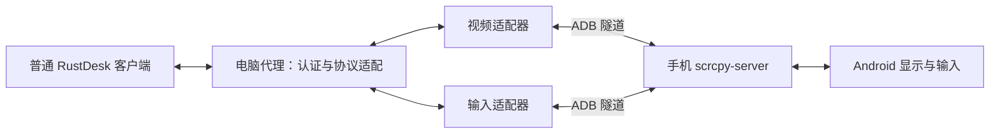

# RustDesk Android 代理技术方案

状态：本机兼容性原型，部分真机验证通过；不是完整远程访问产品。更新：2026-09-07。

## 目标与范围

让普通 RustDesk 客户端经电脑上的代理操作 ADB 连接的 Android 手机。画面由手机上的 scrcpy-server 采集和编码，输入通过 scrcpy 控制通道注入，使用已授权 ADB 的 shell 能力。

初期限定单手机、单控制者、H.264 和基本输入。保留手机原有凭据校验；受保护页面的可视化作为预置测试设备能力，与代理分层。普通连接不安装 root 模块、不修改锁屏设置、不自动输入或重试凭据。

## 当前实现与实际验证

Python 标准库原型已与未修改的 RustDesk 1.4.7 客户端连通：手机桌面、系统 SECURE PIN 确认页面可见；基本点击和拖动经实际操作复测通过。详见 [验证摘要](../evidence/local-rustdesk-validation-2026-09-06.md) 与 [坐标修复](../evidence/input-coordinates-2026-09-07.md)。原始个人会话、截图和现场日志不公开。

已实现：

- 回环地址上的 RustDesk 帧封装和 Protobuf 消息子集。
- 每进程随机密码与挑战认证；单活动会话，认证后启动手机服务。
- 通过 ADB 推送固定 scrcpy 4.1 server，建立视频和控制通道。
- H.264 配置帧、关键帧和时间戳转换，手机压缩流直接封装发送。
- 基本触摸、部分键盘和导航事件、滚动、断线触点释放。
- TestDelay 保活，避免重复回显本端探测消息。

未实现：网络加密、ID 注册、中继、音频、文件传输、剪贴板同步、多设备管理和完整键盘兼容。监听固定为 `127.0.0.1`，不能作为公网或局域网部署产物。PeerInfo 的版本字段仅表示实验兼容目标。

## 架构

| 层 | 职责 | 边界 |
|---|---|---|
| 设备管理 | 明确 serial、ADB 授权、服务与转发清理 | 不自动接管新设备 |
| 会话 | 认证、生命周期、按下状态、超时 | 单控制者，结束时释放触点 |
| 视频 | 解析 scrcpy 头、配置帧、PTS、RustDesk 封装 | 固定 H.264；不在电脑解码再编码 |
| 输入 | 坐标、触摸、部分按键与导航 | 注入手机，不操作电脑桌面 |
| 设备能力 | 系统版本、采集与输入能力验证 | 模块存在不等于目标页面可用 |

### 坐标契约

RustDesk 客户端已经处理窗口缩放和留白，MOVE 消息使用远端画面像素坐标。DOWN/UP 的 x/y 是零占位，必须使用最近一次 MOVE 的位置。合法 MOVE 到 (0,0) 仍然有效。

scrcpy 控制消息携带视频宽高，server 将其映射到设备坐标；代理不重复乘客户端窗口缩放比例。当前实测视频尺寸为 576×1280。旋转时更新显示尺寸并取消触点的路径已实现，但完整旋转交互矩阵尚未验收。

### 媒体和生命周期

1. 客户端认证并声明 H.264 解码能力后启动目标设备服务。
2. 读取 scrcpy 名称、编码和 session header，将尺寸发布给客户端。
3. 配置数据与关键帧配合发送，时间戳换算为 RustDesk 使用的毫秒。
4. 任一视频、输入或心跳任务结束时清理会话，取消按下状态，移除本次 ADB forward。
5. 正式实现需要补充媒体代次、背压、关键帧恢复和可控重连，避免重放旧输入。

## 受保护页面

画面保护发生在手机采集侧。若 scrcpy 输出黑屏，代理不能恢复原始内容。预先配置的 root 测试环境曾证明系统确认 PIN 页面可经整条视频链路显示；代理本身不负责部署该环境。

历史单次 screencap 能看到重启 PIN 页，只是采集层观察，不能代替当前连续视频或成功解锁。保留以下独立验收项：

| 场景 | 验收要求 | 当前状态 |
|---|---|---|
| 普通系统确认 PIN 页面 | 客户端连续画面中可见键盘 | 已观察到可见，未提交凭据 |
| 普通锁屏解锁 | 可见并通过正确凭据进入主用户 | 待验证 |
| 重启后首次解锁 BFU | ADB 可用性、模块效果、实际解锁 | 代理全链路待验证 |
| Private Space | 正常 UI 打开、可见、正确凭据后可访问 | 待验证 |
| 模块失效 | 识别采集限制，不自动改配置 | 待验证 |

手机原有认证始终保留。日志不记录 PIN、文本内容或触摸坐标。系统或模块更新后需重新验证，不沿用旧的“已通过”状态。

## 选型与后续

- 当前最小 Python 协议适配器用于先验证外部编码流与客户端兼容。
- 正式版本可评估 RustDesk fork 的 Android 设备后端，以复用认证、加密、连接、中继及客户端行为；当前尚未实现该架构。
- RustDesk 远程桌面中嵌套 scrcpy 窗口可作为对照，但有二次编码和桌面焦点依赖。
- WebRTC/scrcpy 桥接项目可供参考，不能据此宣称 RustDesk 协议兼容。

本仓库独立维护。未来如修改 RustDesk 或 scrcpy，上游版本和双方协议必须成对固定；先验证视频与基本输入，再做完整凭据矩阵，最后开展多设备、重连和跨网络部署。涉及修改、链接或分发上游组件时保留适用许可要求；本仓库未打包上游程序。

### 阶段

| 阶段 | 目标 | 当前状态 |
|---|---|---|
| P1 | 本机客户端视频与基本输入 | 部分实测通过；10 项协议测试通过 |
| P2 | 锁屏与 Private Space 全链路 | 待验证 |
| P3 | 多设备、恢复、加密与远程部署 | 待设计和实现 |

构建检查使用 `python3 -m py_compile src/local_bridge.py`，测试使用 `python3 -m unittest discover -s tests -v`。未进行 Cargo/Flutter 构建或固件烧录；原型测试不代表完整产品验收。

## 上游参考

- [RustDesk 源码](https://github.com/rustdesk/rustdesk)，调研快照 `dc04b911a1f94919d4dbaedc172fab83b8cba1a4`。
- [hbb_common message.proto](https://github.com/rustdesk/hbb_common/blob/3d6fb2c397f2a9a717440f7e29afed5ab5f5dc03/protos/message.proto)，对应 gitlink 已核对。
- [scrcpy v4.1 协议说明](https://github.com/Genymobile/scrcpy/blob/v4.1/doc/develop.md)。
- [scrcpy-bridge](https://github.com/beeos-ai/scrcpy-bridge) 与 [ws-scrcpy](https://github.com/NetrisTV/ws-scrcpy)：桥接方向参考，未验证其 RustDesk 兼容性。
- [DisableFlagSecure](https://github.com/LSPosed/DisableFlagSecure)：受保护页面测试环境的相关上游；不包含安装流程或通用兼容承诺。
